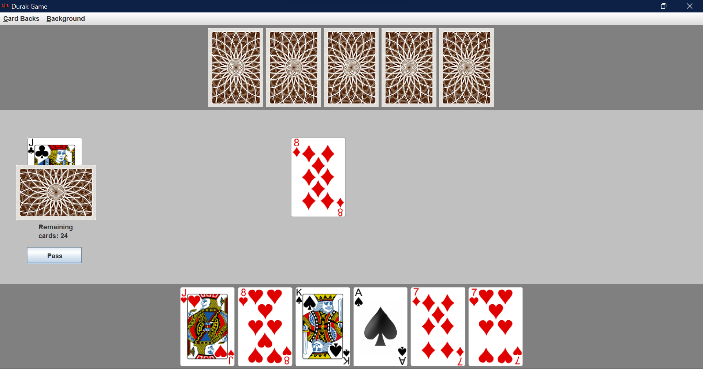

# Durak Card Game
Made by [Ginny Allen](https://github.com/evginny) & [Nicholas Pena](https://github.com/Nick-Pena).

## Description
This program was a final project for COP3252 (Advanced Java Programming). It represents a classic Russian card game called Durak. The project was made by Evgeniya Kalashnikova & Nicholas Pena.  
[You can find the game rules here.](https://gathertogethergames.com/durak) 

## UI Explanations

At the center of the screen, you can see the currently played cards. At the bottom of the screen is your hand, and at the top of the screen is your opponent's hand. To the left is the trump card displayed underneath the remaining deck. At the bottom left there is a button to pass your turn. There is a menu bar at the top for customization.

If there is a card in play at the start of the hand, you are defending. If there is no card in play at the start of the hand, you are attacking.

Click on the card you would like to play, if the move you are trying to make is invalid it won't be added to the center of the screen.

If you click the pass button as an attacker, the turn is over and you become the defender.

If you click the pass button as a defender, and you can't beat the attack then you take all the cards in play and you remain the defender.

## Extra feature

As an extra feature, there is the customization of the card backs and background colors of the panels within the game. All images used in this game are open source.

## Running the Game

This project was made on Java 17, so any version before and including it will work for compilation. Either use an IDE of your choice, or if you have a JDK installed you can compile it from the /src/ folder. **Game.java** contains the main class for running the game.
